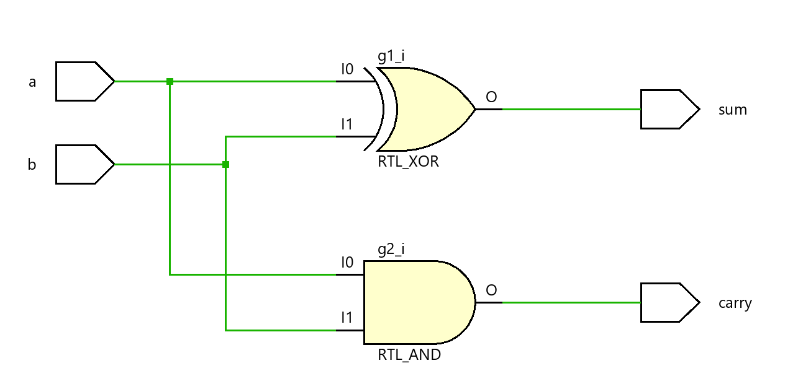
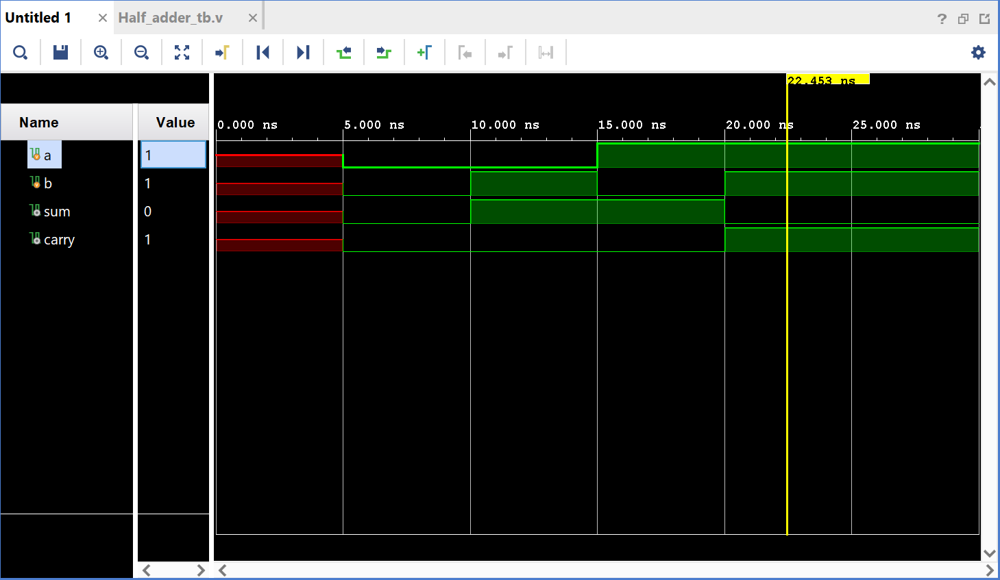
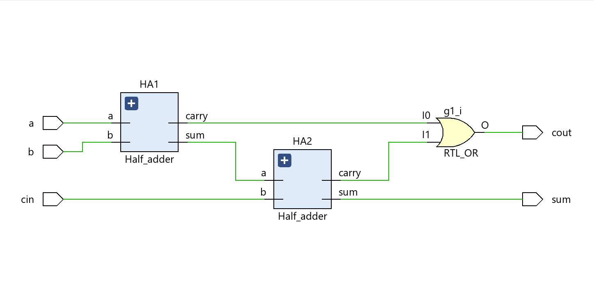
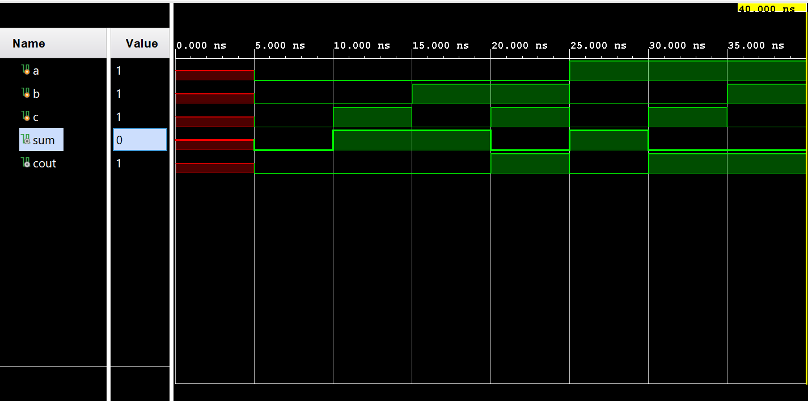
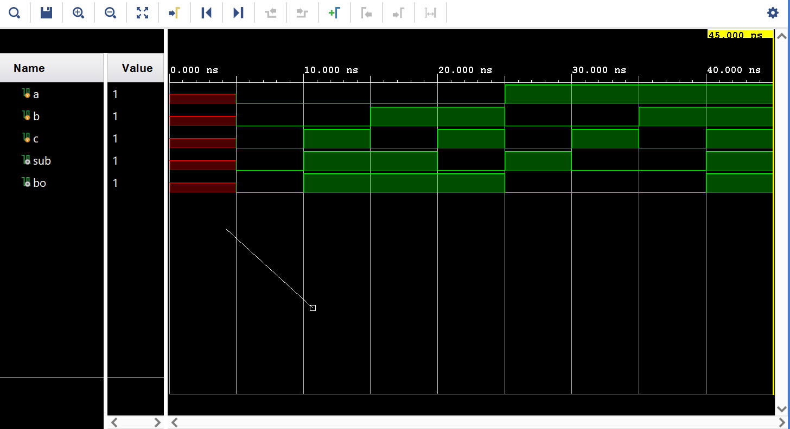
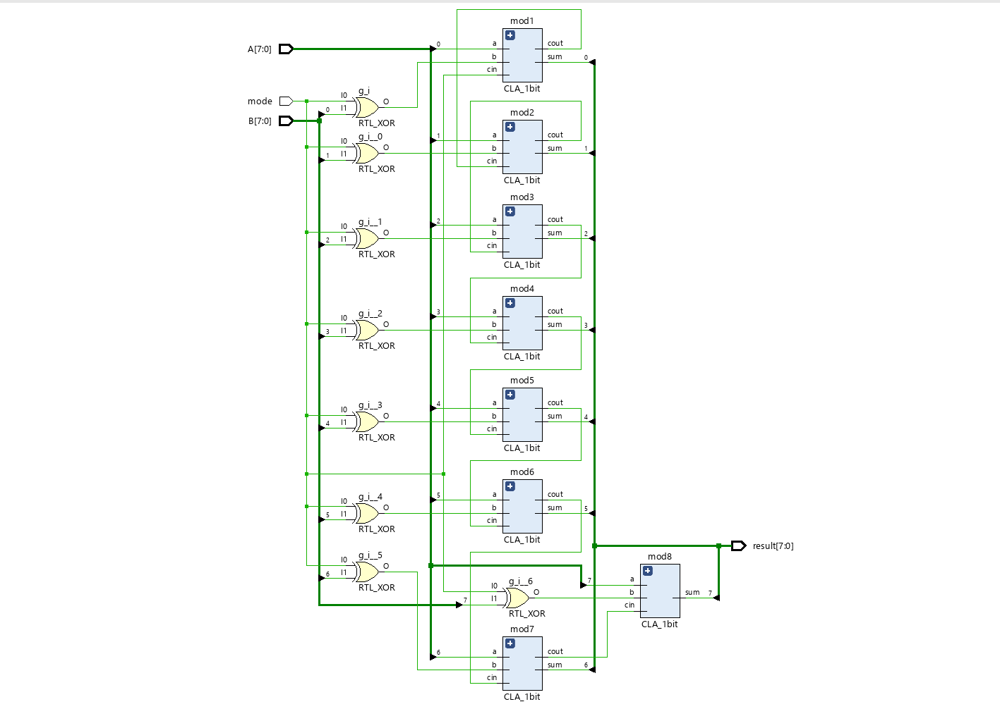

# Adder and Subtractor Circuits

This project implements various adder and subtractor circuits using Verilog hardware primitives.

## Design Overview
- **Half Adder**
- **Full Adder** (built using Half Adders)
- **Full Subtractor** (built using Half Subtractors)
- **4-bit Ripple Carry Adder**
- **8-bit Controlled Adder-Subtractor**

All modules use basic Verilog primitives to model real hardware behavior.

## Output Schematics and Waveforms

### 1. Half Adder
#### Schematic

#### Output Waveform

### 2. Full Adder
#### Schematic

#### Output Waveform

### 3. Full Subtractor
#### Schematic

#### Output Waveform

### 4. 8-bit Controlled Adder-Subtractor
#### Schematic

#### Output Waveform

## How It Works
- **Half Adder:** Computes sum and carry of two bits.
- **Full Adder:** Extends Half Adder to handle three inputs (A, B, Cin).
- **Full Subtractor:** Computes difference and borrow using two half subtractors.
- **Ripple Carry Adder:** Chains Full Adders to perform 4-bit addition.
- **Controlled Adder-Subtractor:** Adds or subtracts two 8-bit numbers based on a control signal.

## Output Verification
The output waveforms were verified using **truth tables** for each of the modules:
1. **Truth Table Comparisons:**  
   - A truth table was created for each adder and subtractor (Half Adder, Full Adder, Full Subtractor, and Controlled Adder-Subtractor). The test cases covered all possible input combinations, ensuring the correct outputs for sum, carry, difference, and borrow.
   - The simulation results were compared to the truth tables to confirm the correct functionality.
   
2. **Simulation in Vivado:**  
   All Verilog modules were synthesized and simulated using Vivado's simulation tools. The waveforms generated were verified against the corresponding truth tables.
   
3. **FPGA Hardware Validation (Basys 3):**  
   The designs were deployed on the Basys 3 FPGA board, and the output signals were observed on an oscilloscope. The measured outputs were verified against the expected outputs derived from the truth tables.

4. **Edge Case Testing:**  
   Special test cases (like adding/subtracting with zero, maximum values, and carrying/borrowing at boundaries) were also included in the truth tables to ensure correct operation.

## Note
- The **Carry-Lookahead Adder (CLA)** modules need to be updated.

## Tools Used
- Xilinx Vivado
- Basys 3 FPGA Board (for testing and synthesis)

